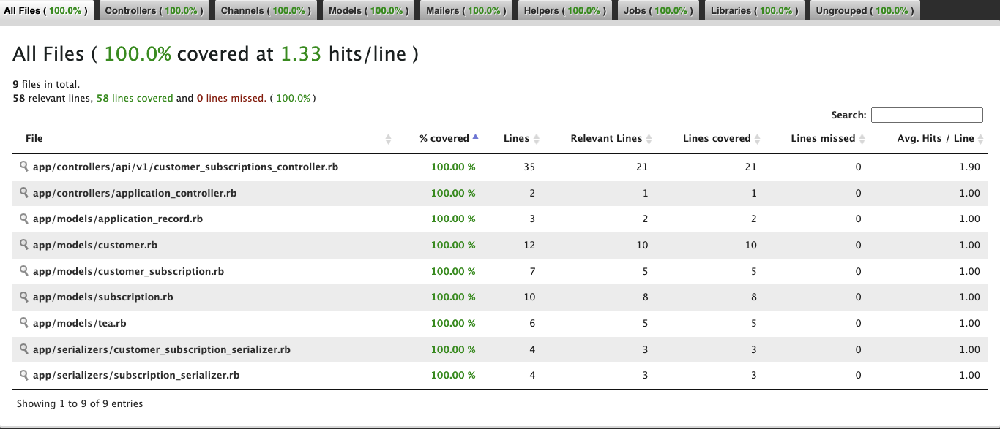

# Thomas Hayes' Take-Home Challenge

This app is a Rails API for a subscription tea service. 

### Built With

[![Rails][Rails.org]][Rails-url]
## Getting Started
### (for Mac)
### Prerequisites
- Ruby Version 2.7.4
- Rails Version 5.2.7
### Gems
- RSpec 
- Pry
- SimpleCov
- Shoulda-Matchers
- jsonapi-serialize
### Installation
1. Create a parent directory for the project on your local machine and open a terminal session and enter the following commands:

```sh
$ mkdir <directory_name>
```
- Navigate into the directory using the '$cd' command
```sh
$ cd <directory_name>
```
2. Clone this repository:<br>
Enter the following commands for SSH to clone the application repository.<br>
- Using the SSH key
```sh
$ git clone git@github.com:thayes87/take_home.git
```
- Once cloned, you'll have a new local copy in the directory you ran the clone command in. Navigate into the  directory using the `$cd` command.
```sh
$ cd take_home
```
3. Install required gems: <br>
```shell
$ bundle install
```
4. Database Migration<br>
Before using the web application you will need to setup your databases locally by running the following commands:
```shell
$ /take_home main $ rails db:{drop,create,migrate,seed}
```
5. Run Bundle Exec Rspec to confirm 34 passing tests with 100% test coverage
```
bundle exec rspec
```


### Data Base Schema


# Rest API's
## Post Customer Subscription
### Request

POST '/api/v1/customer_subscriptions'

### Successful Response
```
{
    "data": {
        "id": "1",
        "type": "customer_subscription",
        "attributes": {
            "id": 1,
            "customer_id": 1,
            "subscription_id": 1
        }
    }
}
```

## Delete Customer Subscription

### Request

DELETE "/api/v1/customer_subscriptions/#{customer_subscription.id}"

### Successful Response
```
{
    "status": 200
}
```
## Get Customer Subscriptions 

### Request

GET "/api/v1/customer_subscriptions/#{customer.id}"

### Successful Response
```
{
    "data": [
        {
            "id": "1",
            "type": "subscription",
            "attributes": {
                "id": 1,
                "title": "Lavendar weekly",
                "price": 1.5,
                "status": "active",
                "frequency": 7,
                "tea_id": 1
            }
        }
    ]
}
```
### Contact
- Thomas Hayes - [@thayes87](https://github.com/thayes87)<br>
Project Link: [https://github.com/thayes87/take_home](https://github.com/thayes87/take_home)


<!-- MARKDOWN LINKS & IMAGES -->
[Rails.org]: https://img.shields.io/badge/rails-%23CC0000.svg?style=for-the-badge&logo=ruby-on-rails&logoColor=white
[Rails-url]: https://rubyonrails.org